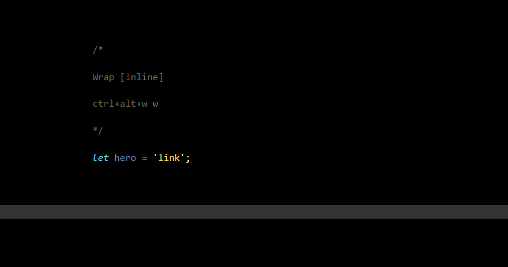
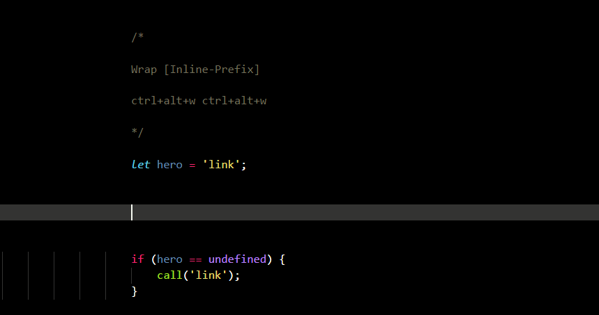

# Wrap Console Log

* Optimized for keyboard
* Keeps code formated

## No selection needed

This extension will wrap the word on or next to the cursor.

Place the cursor before, after or on a word and press any of the hotkeys to wrap it with `console.log`.

> ### Inline

*  `Ctrl+Alt+W` + `W`

Press `Ctrl+Alt+W` and `W` to wrap and replace with `console.log` on the current line.

>### Up

* `Ctrl+Alt+W` + `Up`

Press `Ctrl+Alt+W` and `Up` to wrap and put `console.log` on the line above.

>### Down
* `Ctrl+Alt+W` + `Down`

Press `Ctrl+Alt+W` and `Down` to wrap and put `console.log` on the line below.

---

## Log with prefix

> ### Inline-Prefix

*  `Ctrl+Alt+W` + `Ctrl+Alt+W`

Press `Ctrl+Alt+W` and `Ctrl+Alt+W` to log with a prefix on the current line.

>### Up-Prefix

* `Ctrl+Alt+W` + `Ctrl+Alt+Up`

Press `Ctrl+Alt+W` and `Ctrl+Alt+Up` to log with a prefix on the line above.

>### Down-Prefix
* `Ctrl+Alt+W` + `Ctrl+Alt+Down`

Press `Ctrl+Alt+W` and `Ctrl+Alt+Down` to log with a prefix on the line below.